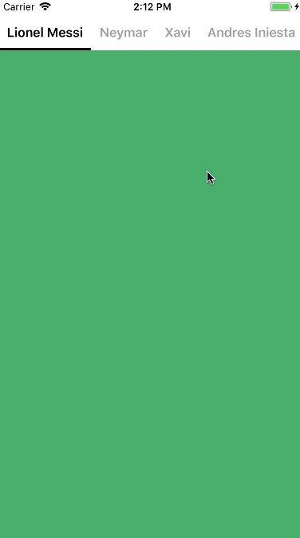

# DLPageMenu
A paging menu controller built from other view controllers placed inside a collection view (like Spotify, Windows Phone, Instagram)



## Installation

**CocoaPods**

DLPageMenu is available through [CocoaPods](http://cocoapods.org). !! Swift only !!

To install add the following line to your Podfile:

    pod 'DLPageMenu'

## How to use DLPageMenu

1. Initialize View Controllers

```
// Init View Controllers
var viewControllers = [UIViewController]()
let names = ["Lionel Messi", "Neymar", "Xavi", "Andres Iniesta", "Sergio Busquets", "Thierry Henry", "Abidal", "Alves", "Carles Puyol", "Gerard Pique"]
for name in names {
	let viewController = UIViewController()
	viewController.title = name
	viewController.view.backgroundColor = UIColor(red: CGFloat(arc4random_uniform(256))/255, 
					              green: CGFloat(arc4random_uniform(256))/255, 
						      blue: CGFloat(arc4random_uniform(256))/255, 
						      alpha: 1)
	viewControllers.append(viewController)
}
```

2. Initialize Page Menu UI Option

```
// Page menu UI option
var option = PageMenuOption(frame: CGRect(x: 0, y: 20, width: view.frame.size.width, height: view.frame.size.height - 20))
option.menuItemHeight = 44
option.menuTitleFont = .boldSystemFont(ofSize: 16)
option.menuTitleColorNormal = .lightGray
option.menuTitleColorSelected = .black
option.menuItemBackgroundColorNormal = .white
option.menuItemBackgroundColorSelected = .white
option.menuIndicatorColor = .black
```

3. Initialize `DLPageMenu` with viewControllers and option construnctor

```
// Init Page Menu with view controllers and UI option
let pageMenu = DLPageMenu(viewControllers: viewControllers, option: option)
view.addSubview(pageMenu)
```

Result: 


## Customization:

Option property of PageMenu.

| Property | Type | Definition |
|:-----------|:------------|:------------|
| frame | CGRect | Size and position of the page menu |
| menuItemHeight | CGFloat | Height of the menu |
| menuItemWidth | CGFloat | Width of the menu |
| menuItemBackgroundColorNormal | UIColor | Background color of the menu (Unselected) |
| menuItemBackgroundColorSelected | UIColor | Background color of the menu (Selected) |
| menuTitleMargin | CGFloat | Margin between menu items |
| menuTitleFont | UIFont | Menu Title font |
| menuTitleColorNormal | UIColor | Menu Title color (Unselected)  |
| menuTitleColorSelected | UIColor | Menu Title color (Selected)  |
| menuIndicatorHeight | CGFloat | Height of the menu indicator  |
| menuIndicatorColor | UIColor | Color of the menu indicator  |
